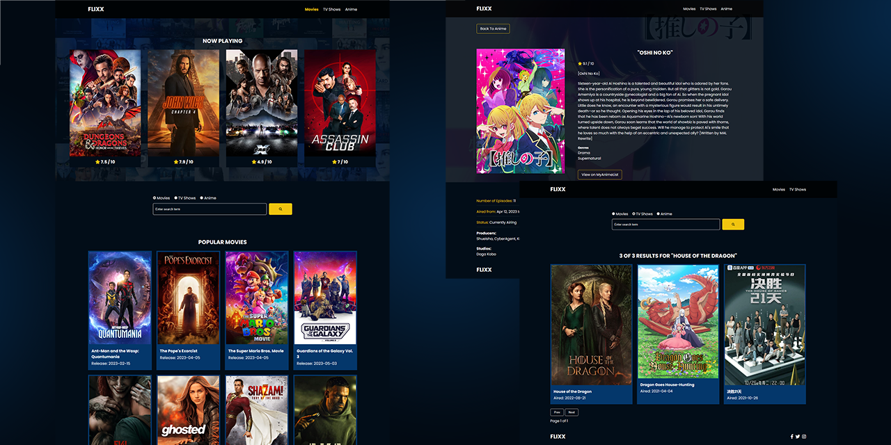
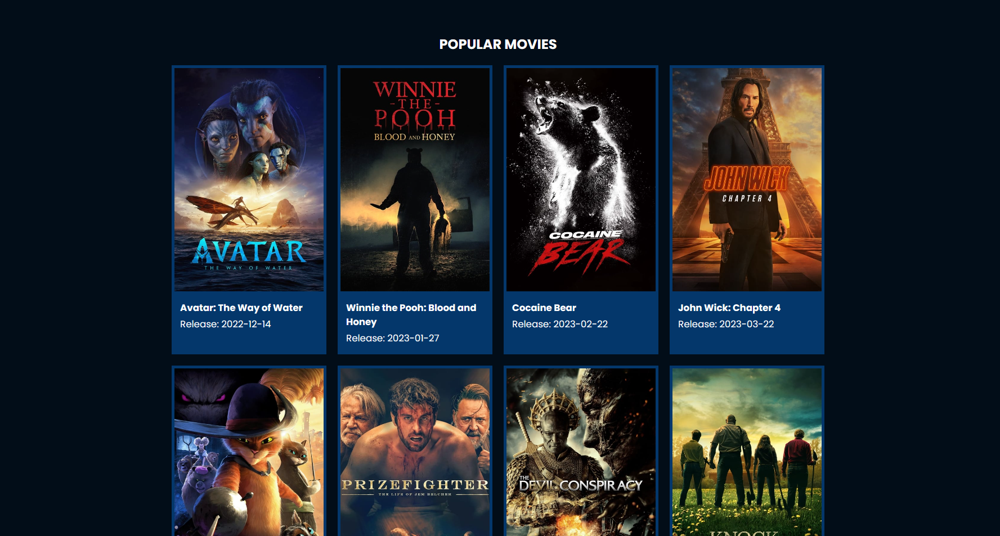
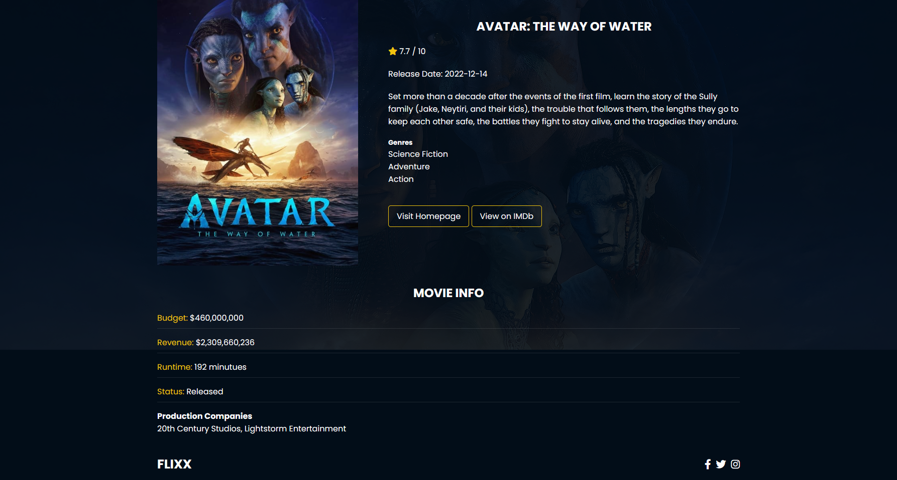
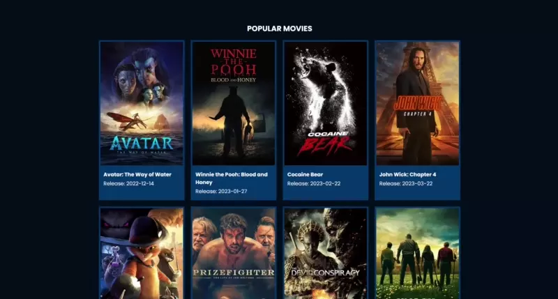
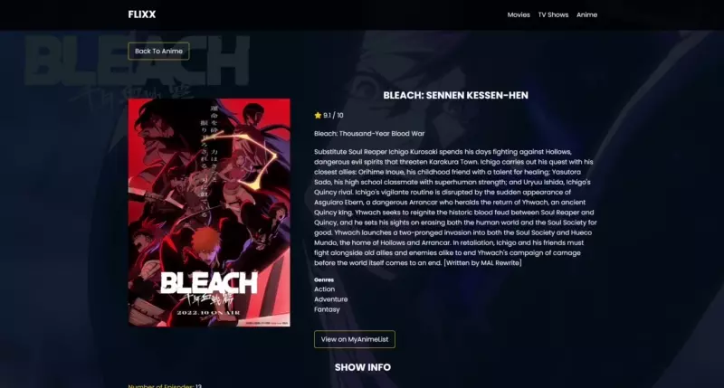
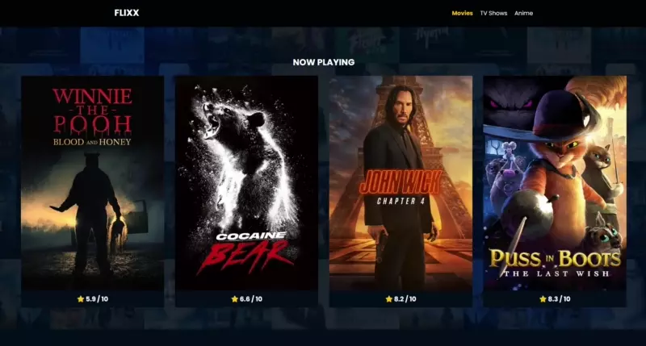
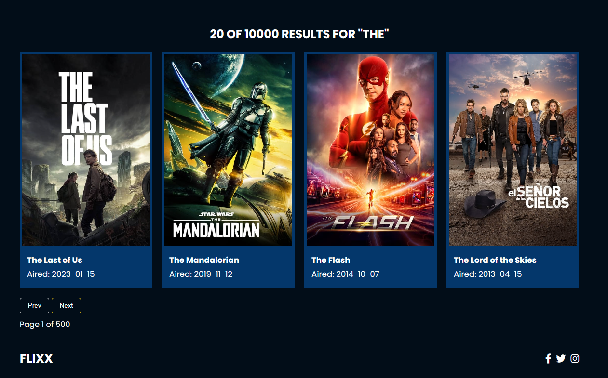
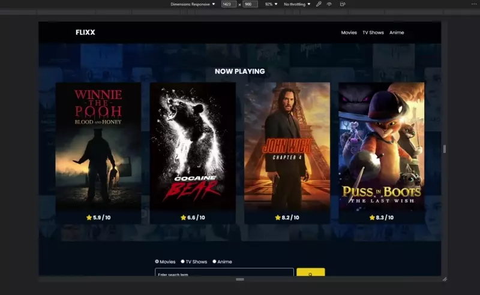
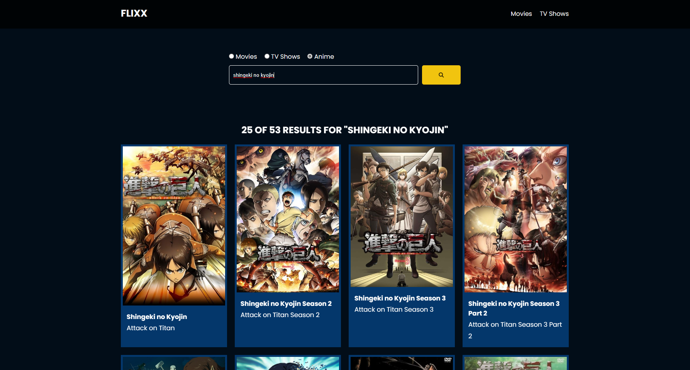

# FLIXX

---

An interactive web app for trending Movie, TV Show, and Anime info from TheMovieDB and MyAnimeList.

Built with:

- Vanilla HTML, CSS, JavaScript
- [TMDB API v3](https://developers.themoviedb.org/3)
- [Jikan API v4](https://docs.api.jikan.moe/)

## Features

### Display Popular Titles

For **Movies** and **TV Shows** titles, the app fetches [popular movies](https://www.themoviedb.org/movie) and [popular shows](https://www.themoviedb.org/tv) from `TMDB API` and displays the title `poster`, `name`, `rating`, and `release date` to the main UI.

For **Anime** titles, the app fetches [MAL top airing anime](https://myanimelist.net/topanime.php?type=airing) from `Jikan API`.

Demo

### Display Title Details

The app displays each title details in a dynamic `{title}-details.html` page that is routed via a multipage `router`. The page content is dynamically rendered based on the endpoint `type[movie,tv,anime]` and the `title.id`.

For **Movie** details, the page displays box office info such as `budget`, `revenue`, `runtime`, _etc._

Demo

For **TV** and **Anime** details, the page displays airing info such as `episode count`, `air date`, `networks`, `producers`, `studios`, _etc._

Demo

### Search

The app provides a search function that accepts user input `term` and endpoint `type[movie,tv,anime]`.

Search results are dynamically rendered on `search.html` page with dedicated `display`, `error handling`, and `pagination` functions.

## Extras

### Search Pagination

For **Movies** and **TV**, displays 20 per page. For **Anime**, displays 25 per page.

### Hero Section Animation

Hero section displays [TMDB Now Playing Movie](https://www.themoviedb.org/movie/now-playing) titles in an animated slider using [Swiper](https://swiperjs.com/) library.

### Responsiveness

### Styling

- [Font Awesome library](https://fontawesome.com/)
- [Spinner CodePen](https://codepen.io/tbrownvisuals/pen/edGYvx)

### Troubleshooting

#### English title search not accurate for anime

[MAL](https://myanimelist.net/) use [romaji](https://en.wikipedia.org/wiki/Romanization_of_Japanese) _(Romanised Japanese)_ names for most of their anime entries as `default title`. Thus leads to the fact that `Jikan API` [getAnimeSearch](https://docs.api.jikan.moe/#tag/anime/operation/getAnimeSearch) only returns relevant results if searched with **romanji** title name.

For example:

- Search results for "attack on titan"
  

- Search results for "shingeki no kyojin"
  

#### Anime category crashed / lagged / slowed

The app uses the free and open-source [Jikan public API](https://docs.api.jikan.moe/) to fetch anime data. Thus, it can only operate within [Jikan Rate Limit](https://docs.api.jikan.moe/#section/Information). So if you run into problems, please be patient and try again after some time.

 

---

Credits

- [Traversy JS course](https://www.traversymedia.com/modern-javascript-2-0)
- [@bradtraversy GitHub source](https://github.com/bradtraversy/flixx-app)

